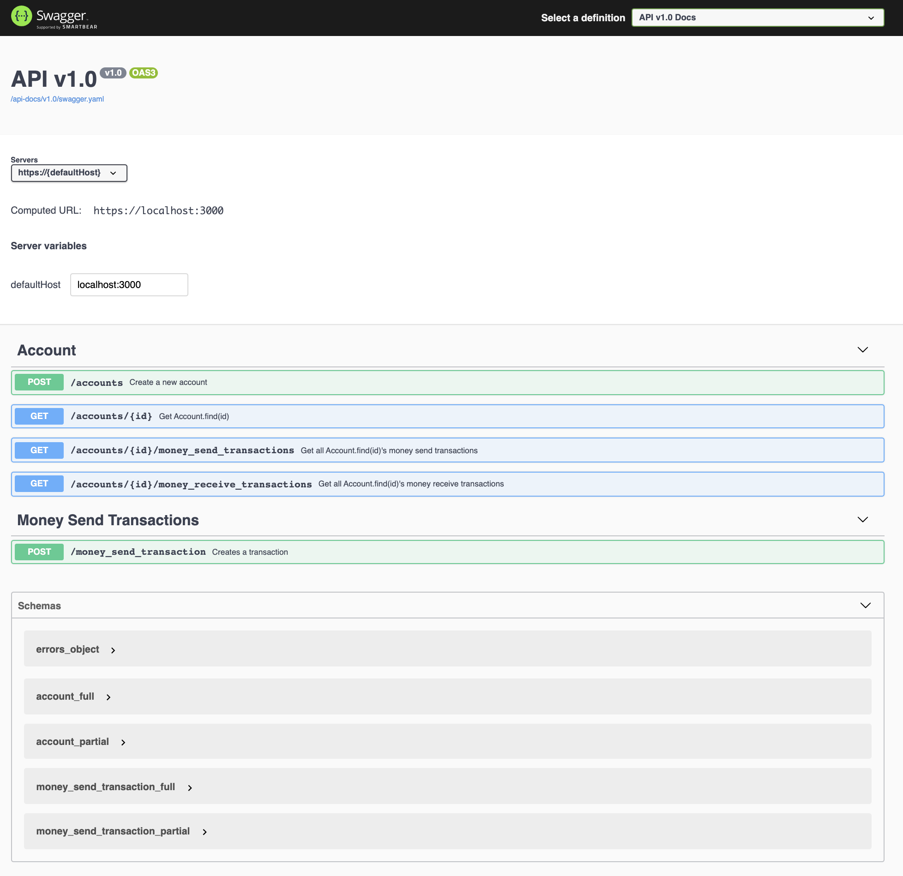

# Installation

## Requirements

- :gem: Ruby version `2.7.2` (manage Ruby versions with [rvm](https://rvm.io/) or [rbenv](https://github.com/rbenv/rbenv))
- :elephant: PostgreSQL

## Getting started

- Fork & clone the repository
- `bundle install`
- Run `rails db:create db:migrate`
- Run `bundle exec rspec` to validate the installation
- Run `rails server`
- You're good to go :tada:

# Challenge

See [`doc/challenge/README.md`](./doc/challenge/README.md)

______

# Solution

## Run
Setup and run server
1. `rails db:create db:migrate`
2. `bundle install`
3. `rails s`

Run tests
```
bundle exec rspec
```

## OpenAPI UI

(Available at http://localhost:3000/api-docs)

## Features:
- Versioned gems
  - All gems have MAJOR and MINOR versions spcecified
    - This way we don't automatically pull breaking changes on `bundle update`
- Versioned API
  - Semantic versioning with MAJOR and MINOR versions specified for endpoints
    - PATCH not specified because user doesn't need to specify version for bug fixes. They (bug fixes) can assumed to happen in the background via ticket resolutions.
  - Read more about semantic versioning [here](https://semver.org/)
- [OpenAPI](https://swagger.io/specification/) compliant endpoints
  - All API endpoits have OpenAPI specs
  - UI viewable at http://localhost:3000/api-docs
  - YAML file viewable at `swagger/v1.0/swagger.yaml`
  - If you change any specs (at `spec/requests`), make sure you run `rails rswag:specs:swaggerize ` after
    - You will also need to uncomment all `run_test!` calls before running the swaggerize command above, and then comment them
    back in after. (That's because they're used to generate `swagger.yaml`, but we don't use them. We use regular integration tests
    instead. Further comments about this are at `spec/requests/api/v1.0/accounts_spec.rb:26`)
  - To generate a controller spec file, run `rails generate rspec:swagger API::v1.0::MyController` (replacing `MyController` with the target controller name)
- Integration tests
  - All API endpoints have integration tests
    - (Total number of tests: 42)

## Added Gems:
- `rswag`
- `database_cleaner-active_record`

## Assumptions:
- All transactions are done in a single currency

